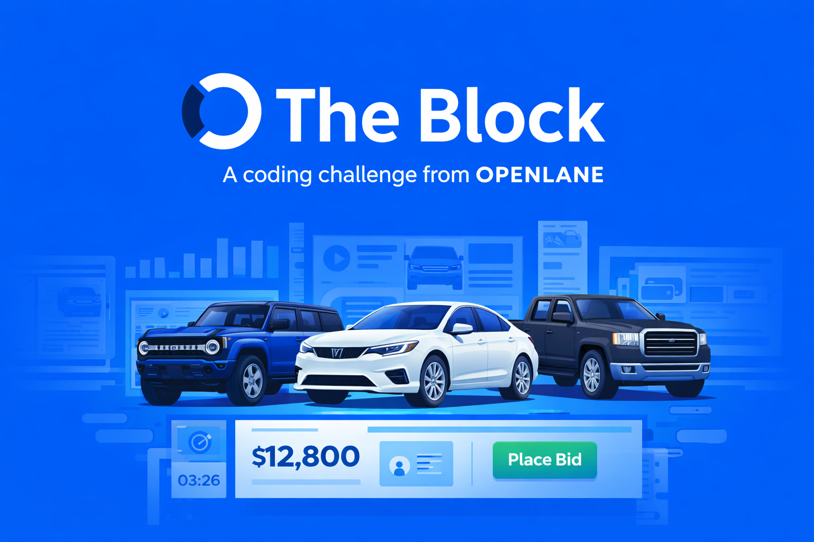

<p align="center">
  
</p>

# OPENLANE QA Automation Challenge


OPENLANE powers one of the world's largest digital marketplaces for used vehicles. Every day, thousands of vehicles move through our platform - inspected, listed, auctioned, and sold.

## Challenge Goal

You are given a runnable system under test (SUT):

- Browser UI for inventory + vehicle details + bidding
- HTTP API endpoints used by the UI

Your task is to design and implement a QA automation solution.

## Assumptions You Can Make
- Please spend no more than 3-4 hours of work on this. If you spend more, that's your call, but we do not expect a fully built marketplace.
- Use any framework, language, or stack.
- You may use AI tools and coding assistants, and their use is encouraged. Be ready to explain how you used them, what decisions you made, and what parts of the implementation you would refine.
- Make reasonable product decisions, document your assumptions, and optimize for clarity over surface area.


## What To Submit

1. **Fork this repo** to your own GitHub account
2. Complete the challenge work in your fork. We excpect a runnable automation suite covering meaningful web E2E + API scenarios
3. Include a **README** in your repo with setup instructions and notable decisions, test strategy and prioritization, notes on gaps, risks, and next steps
4. Brief explanation of how AI tools were used (if used)

When you're finished, share the link to your repo with your contact at **OPENLANE**

We've included a [submission template](SUBMISSION.md) if you want a starting point.

We should be able to clone your repo and have it running locally by following your README.


## Timeline

You have **5 days** from when you receive this challenge to submit it.

This is not a speed run. We care more about your decisions and tradeoffs than the total number of features.

## What Happens Next

After you submit, we'll schedule a **45-60 minute walkthrough** where you'll screen-share and walk us through what you built. More details are in [`WALKTHROUGH.md`](WALKTHROUGH.md).

## How We Evaluate

We're not checking boxes. Here's what we care about in a QA role:

| | What we're looking at |
|---|---|
| **Risk prioritization** | Did you focus on the highest-risk flows, failure modes, and user journeys first? |
| **Coverage quality** | Does the suite cover meaningful API and E2E scenarios, including happy paths and important edge cases? |
| **Signal and reliability** | Are the tests stable, deterministic, and useful when they fail? |
| **Technical quality** | Is the code clean, maintainable, and easy to extend as the app changes? |
| **Judgment** | Did you scope the work well for the time budget and make sensible tradeoffs? |
| **Workflow** | Can you explain how you investigated, validated, and refined the suite? (assessed in the walkthrough) |

## SUT Features

- Inventory listing
- Vehicle detail pages
- Bid placement flow
- JSON API endpoints under `/api/*`

## Local Setup

### Prerequisites

- Node.js 20+
- npm 10+

### Install

```bash
npm install
```

### Run SUT

```bash
npm start
```

Open: [http://localhost:3000](http://localhost:3000)

### Optional Dev Mode

```bash
npm run dev
```

### Run Included Smoke Tests

```bash
npm test
```

## Suggested Candidate Workflow

1. Inspect the app and API manually
2. Define a risk-based test strategy
3. Implement high-value API and E2E coverage
4. Document decisions and known gaps

## Evaluation Focus

We evaluate:

- Test strategy and risk prioritization
- Automation reliability and maintainability
- Failure visibility and debugging signal
- Technical quality
- AI workflow maturity (judgment + verification)
